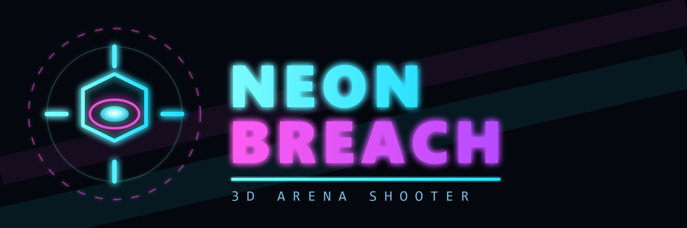

# NEON BREACH

A fast 3D arena shooter that runs in the browser. No build step, no install, no
dependencies to fetch — open `index.html` and play.

Survive escalating waves of hostile machines in a neon arena. Pick them apart with
the pulse carbine; aim for the glowing cores for critical hits. Every fifth wave
brings down an Apex Sentinel.



## Play

Open `index.html` in a modern desktop browser (Chrome, Edge, Firefox, Safari).
Everything runs locally, including the 3D engine — it plays offline.

### Live

| Host | URL |
| --- | --- |
| Vercel | https://neon-breach-game-three.vercel.app |
| GitHub Pages | https://mdhanvantar-web.github.io/neon-breach-game/ |
| Source | https://github.com/mdhanvantar-web/neon-breach-game |

## Controls

| Input | Action |
| --- | --- |
| `W` `A` `S` `D` | Move |
| Mouse | Look |
| Left click | Fire |
| Right click | Focus aim (zoom + tighter spread) |
| `Shift` | Sprint |
| `Space` | Jump |
| `R` | Reload |
| `Esc` or `P` | Pause |
| Gear button | Settings: sensitivity, FOV, volume, graphics, music, screen shake |

**Desktop only.** The game requires a mouse and keyboard (pointer lock), so it
does not work on phones or tablets.

## Hostiles

| Type | Behaviour | Core hits |
| --- | --- | --- |
| Drone | Baseline pursuer | 1 core, front-mounted |
| Brute | Slow, heavily armoured, hits hard | 1 core, front-mounted |
| Dart | Fast, weaves in and out, fires 3-round bursts | 1 core, front-mounted |
| Sentinel | Frontal hex plate deflects body shots until it breaks — flank it to reach the core | 1 core, behind the plate |
| Apex Sentinel | Wave 5, 10, 15… Slow orbital boss with a shield bubble and two side cannons firing 5-round fans | 3 cores, one per quarter |

## Wave modifiers

Each wave (from wave 2, never on a boss wave) rolls one modifier, two from wave 6:

| Modifier | Effect |
| --- | --- |
| `SWIFT` | Hostiles move 40% faster |
| `IRONCLAD` | Hostiles have 50% more health |
| `SWARM` | 50% more hostiles, 30% less health each |
| `VOLLEY` | Hostiles fire faster and more accurately |
| `SCARCE` | No periodic supply drops |
| `VOIDLIT` | Arena blackout — lights drop, fog closes in |

## Music

A generative synth score runs on the WebAudio clock: a 4-bar minor progression
with a lookahead scheduler, bass and arpeggio voices, and a kick/hat pattern.
Tempo and instrumentation scale with the wave number, and an Apex Sentinel adds a
dissonant layer. Toggle it in Settings.

## Scoring

- Base kill: 100, **core hit: 1.8x** the base value, brutes 180, darts 130, sentinels 220
- Apex Sentinel: 2500
- Consecutive kills build a killstreak multiplier, up to **x3.25**
- New personal bests are stored in `localStorage`

## How it works

Everything is hand-written vanilla JavaScript using the three.js WebGL renderer:

- `index.html` contains the markup, HUD styling, and the entire game
- `vendor/three.min.js` — three.js r128, bundled so there is no CDN dependency
- Geometry, arena layout, and all textures are generated procedurally at load
  (canvas-drawn floor grid and wall panels); there are no binary assets beyond
  the logo
- Enemies, projectiles, tracers, and impact debris are pooled and recycled
- One enemy constructor builds every hostile type from a data table, with an
  explicit core-mesh list so crit detection can never confuse a shield collider
  for a weak point
- Lighting is budgeted to 8 real-time lights (1 hemisphere, 1 ambient, 1
  directional with shadows, 2 fills, 1 muzzle, 3 pooled explosion lights);
  everything else uses emissive materials and additive sprites
- `VOIDLIT` re-tunes the existing lights and fog rather than adding any, so the
  light budget never grows
- Player collision resolves against axis-aligned obstacle boxes

## Project layout

```
index.html            the game (markup + styles + all game code)
logo.svg              emblem, vector
logo.png              emblem, 1024x1024
logo-256.png          emblem, 256x256
logo-wordmark.svg     emblem + title lockup
logo-wordmark.png     emblem + title lockup, 2400x800
vendor/three.min.js   three.js r128 (MIT, see vendor/THREE-LICENSE.txt)
```

## Credits

Game code and artwork are original. Bundled third-party software:

- [three.js](https://threejs.org/) r128 — MIT License — © 2010-2021 three.js authors

## License

MIT — see [LICENSE](LICENSE).
